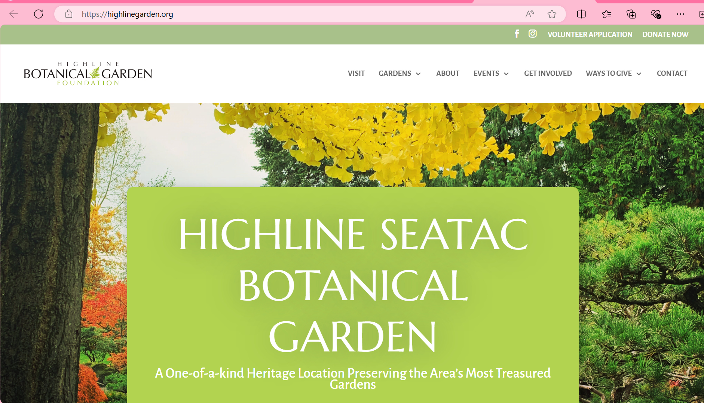
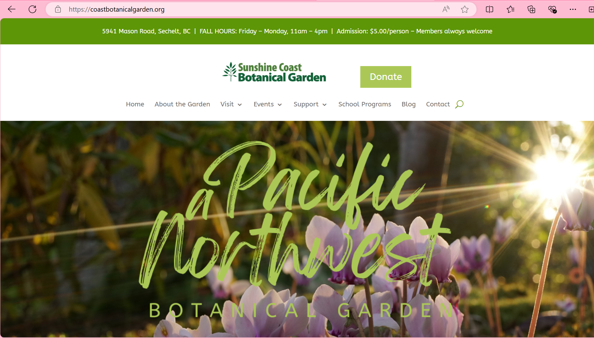
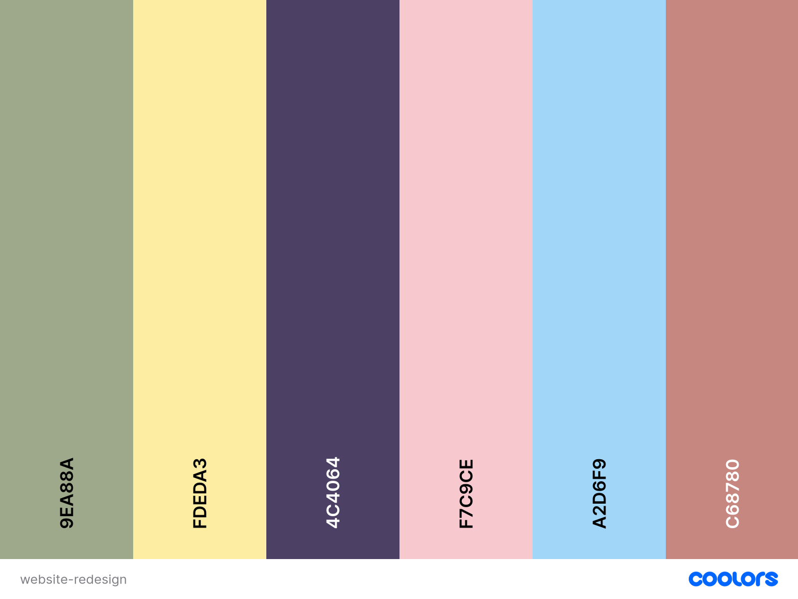

# Website Plan - Rae Hemstreet

## Project Summary

### State what site you have chosen to redesign and build

The site I have chosen to redesign and build is [Kitty Coleman Woodland Gardens](https://woodlandgardens.ca/).

### What is the most important purpose of this website?

The main purpose of the Kitty Coleman Woodland Gardens website is to inform visitors about the gardens, encourage them to explore the natural beauty, and promote events and educational programs. It also highlights the garden's focus on conservation, native plants, and sustainability.

### Who is the target audience? Perhaps there are multiple target audiences?

The target audience for the Kitty Coleman Woodland Gardens website includes nature lovers, gardeners, eco-conscious individiuals, local residents, tourists, and people looking for event venues.

### What is the overall message you are trying to convey to your target audience on this website?

The message I would want to convey is that Kitty Coleman Woodland Gardens is a peaceful, beautiful destination where visitors can connect with  and learn about nature, and experience the diverse local ecosystem. Whether you’re looking to explore the gardens, attend a workshop, or host a special event, the gardens offer a unique, educational, and tranquil experience for all.

### What action do you want the audience to perform before they leave your website? Are there multiple ways they could take action?

**I would want the audience to take the following actions before leaving the website**:
    - Plan a Visit: Encourage visitors to check out the garden's hours, map, and admission details to plan their visit
    - Register for Events: Direct them to sign up for workshops, tours, or special events
    - Book the Venue: For those interested in hosting events like weddings, I’d want them to inquire about booking the gardens
    - Sign Up for the Newsletter: A way to keep visitors engaged over time and informed about upcoming events and news

**Multiple Ways to Take Action**:
    - Contact Form: To make inquiries about visiting, events, or venue booking
    - Online Booking/Registration: Easy-to-use forms for event sign-ups and venue reservations
    - Email Sign-up: A newsletter signup for ongoing engagement and updates
    - Social Media Links: Encourage visitors to follow and engage on social media for more updates, event reminders, etc

### Why is their current site not appropriate?

**Test Results**:
    - Lighthouse score was 92 for performance, 88 for accessibility, 100 for best practices, and 92 for SEO.
    - Pingdom score was 89 (B).
    - WAVE report showed only 2 errors, 3 contrast errors, and 3 alerts.

Overall, based on the look of the website alone, I was shocked by these results. The website has good bones, and minimal problems based on my testing. It is also relatively well laid-out from a navigation standpoint, everything is where one would expect. The layout is responsive, works well on desktop, mobile, and in between. However, it is extremely dated. It needs a big facelift to bring it into the modern era.

## Look and Feel

### Mood: What are some specific visual moods the site should convey?

The visual mood should reflect the natural beauty and tranquility of the gardens. It should convey a sense of peacefulness and natural beauty, with inviting and warm imagery that makes visitors feel welcome and connected to the garden's mission and surroundings. Warm, natural colors, and beautiful photographs of the gardens will draw visitors in beautifully.

### Inspiration: Research and include homepage screenshots and urls of 2 website designs that you feel are good inspiration for the redesign of your website because they communicate similar moods to what you want your website to convey.

All three of these websites are good inspiration for the redesign of the website. They all feature large, eye-catching imagery to really inspire users to visit their gardens.

### Colours: Are there any brand colours that you can use? List at least 3 colours that you plan to use in your redesign

Most of the current colors featured in the current website contribute to the dated feel that it currently has. I created a quick rough idea of colors I would like to see in the redesign, however I often change things as I go.

### Images: Is there a logo, photos, icons or illustrations that can be used from the original site?

The current logo is relatively well designed and I can keep that. As for images, the current website contains an extensive gallery of photos of the gardens, and there are lots of beautiful photos that I can use to feature on the website, rather than hidden away in album folders as they are currently.

### Fonts: Are there any brand typefaces that you can reuse? List 2 font-families that you plan to use in your redesign

The current fonts featured on the site contribute to the website feeling incredibly dated and need to be replaced.

I may choose different fonts as I progess with this project, but currently my choices are:
    - Headings - Montserrat
    - Body - Poppins

## Website Content

For my redesign, I will build the Homepage, Our Story, and Contact pages.

### Homepage

**Header**
- **Logo**
- **Main Navigation**:
    - *Home*
    - *Our Story*
    - *Gallery*
    - *Events*
    - *Plan Your Visit*
    - *Contact Us*

**Hero Section**
- **Heading**: *"Where Nature and Tranquility Meet" or "Wander. Wonder. Discover. The Gardens Await."*
- **Image**: *Large, focal point of homepage, high quality photo showcasing the natural beauty of the gardens*
- **Link to Plan Your Visit**: *"Plan Your Escape to the Gardens"*

**About Section**
- **Heading**: *"Where Passion for Nature Blossoms"*
- **Paragraph**: *Brief introduction to the Gardens, how they came to be, facts, etc*
- **Second paragaph**: *Brief introduction to what goes on at the Gardens during the year (Art shows, Christmas programs, etc.)*
- **Image**: *Small, yet high-quality and eye-catching photo to support the content*
- **Link**: *"Discover Our Story" link to About Us page*

**Video/Call to Action Section**
- **Heading**: *"The Garden Awaits: Uncover Nature’s Hidden Treasures" or similar*
- **Video**: *Video showcasing the beauty of the Gardens to encourage users to visit*
- **Link/Call to Action**: *"Escape to Tranquility - Plan Your Visit"*

**Events Section**
- **Heading**: *"Wander, Wonder, and Participate: Upcoming Events" or "Step Into the Garden: Upcoming Events and Activities"*
- **Paragraph**: *Brief description of events the Garden holds throughout the year*
- **Table or Carousel of Events the Garden holds (each includes)**:
    - *Event heading*
    - *Event image*
    - *Short description*
    - *Link to detailed information*

**Footer**
- **Logo**
- **Secondary Navigation**:
    - *Home*
    - *Our Story*
    - *Gallery*
    - *Events*
    - *Plan Your Visit*
    - *Contact Us*
- **Follow Us** *Social Media Links*:
    - *Facebook link*
- **Copyright**: *“Rae Hemstreet, DGL 103”*
- **Disclaimer**: *“This is a fictional website that was designed and coded as an educational exercise. It is not intended to be seen outside of the class environment. None of the content and images were approved by the business owner.”*

### Our Story

**Header**:
- *Same as Homepage*

**Small Hero**:
- **Heading**: *"Our Story, Rooted in Nature"*
- **Image**: *Relatively large, high-quality image showcasing the beauty of the Gardens*

**Our Story section**:
- **Paragraphs**: *About the garden, how it came to be, facts about the garden, etc.*

**Photo Carousel section**:
- **Heading**: *"Captured Moments of Tranquility" (or similar)*
- **Images**: *Carousel of a handful of images to click through, further showcasing the Gardens*

**Footer**:
- *Same as Homepage*

### Contact Us

**Header**:
- *Same as Homepage*

**Small Hero**:
- **Heading**: *"Your Gateway to the Garden: Get in Touch" (or similar)*
- **Image**: *Relatively large, high-quality image showcasing the beauty of the Gardens*

**Location Section**:
- **Heading**: *“The Garden Awaits - the Path to Kitty Coleman Woodland Gardens” (or similar)*
- **Google Maps embed of location**
- **Paragraph**: *Short paragraph briefly explaining the Garden’s location relative to nearby cities or landmarks*

**Contact Section**:
- **Heading**: *“Connect with Us”*
- **Web table with phone number, email address, address, GPS co-ordinates**

**Contact Form**:
- **Heading**: *“Get in Touch”*
- **Web form** *containing*:
    - *Email Address*
    - *Name*
    - *Phone Number*
    - *Subject (with drop-down list: general questions, event questions, host an event, etc)*
    - *Message*

**Footer**:
- *Same as Homepage*